# StromboliChain PoA Developmental Blockchain
by Steve Stark

This activity is the Week 18 homework assignment, and is centered around building a new developlental proof-of-authority blockchain from scratch, then running two or more minting nodes on top of that blockchain. Success in these tasks will be verified via test transactions through a MyCrypto wallet. 

Following are the steps taken to generate StromboliChain, our PoA blockchain, and how to restart the processes for future use. 

# I. Create Minimum Two Accounts to Run as Nodes on the Blockchain

    * All terminals used in this project are to be opened on the blockchain tools file on the user's system. 

* The first step will be to create two accounts to be run as nodes on the blockchain, so that when we create/activate the blockchain we will have the addresses of these accounts available to us to enter into the blockchain genesis block. 

* Open a terminal on top of the blockchain tools directory. Enter: ./geth account new --datadir node1 

* You will be prompted to create a password, and then to confirm the password. Once you do this, you need to create a new .txt file called password1.txt and enter into it only the passowrd - no other characters - and save it in your blockchain tools directory. 

* Next, you will run the same command but change node1 to node2, and also save this password but in a .txt entitled password2. The command line should look like: ./geth account new --datadir node2

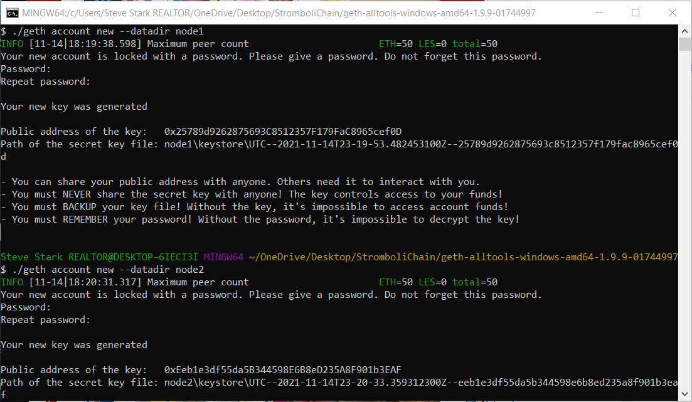

* Create another .txt file called 'Secret Keys' or something to that effect. For node1 and node2, you will need to copy and paste the "Public address of the key" and "Path of the secret key file" into this new .txt file for future reference. These public addresses will be used in the next step, when we create the genesis block for our chain. 

# II. Generate Genesis Block

* Open a new terminal on the blockchain tools directory. 

* If you were setting up a new blockchain, you would enter: ./puppeth to launch Puppeth, the Ethereum private network manager. A prompt will ask you to name the network to administer, and this is where you would name it. However, since StromboliChain has already been set up, you actually need to enter ./puppeth --network=strombolichain

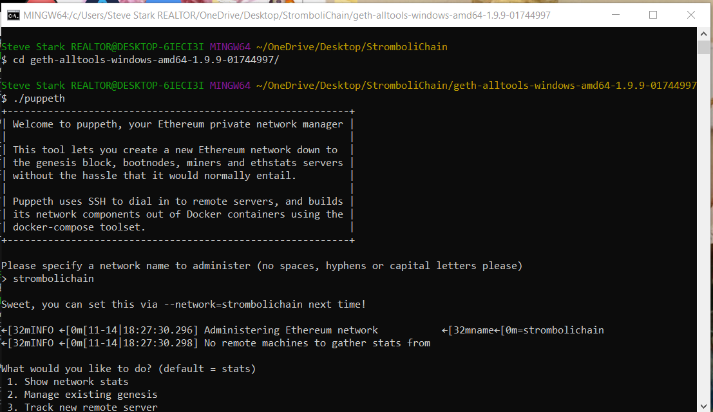

* If running the previously-existing blockchain, you would select prompt 2 from the list - Manage existing genesis. 

* In the original set up, you would also select prompt 2, but it is a different prompt - Configure new genesis. Then Select 1 - Create new genesis from scratch. For this project, we are using the Clique - proof of authority algorithm, so select prompt 2. 

* Hit return to accept the default of 15 seconds per block.

* Now you are going to enter the addresses - one at a time - for your two-plus nodes, so as to give them both permission to seal blocks. Immediately thereafter you will be asked which accounts need to be pre-funded. Again, enter both addresses one at a time. Next, there will be a prompt asking you if the precompile address should be prefunded with 1 wei. In this case, say no. 

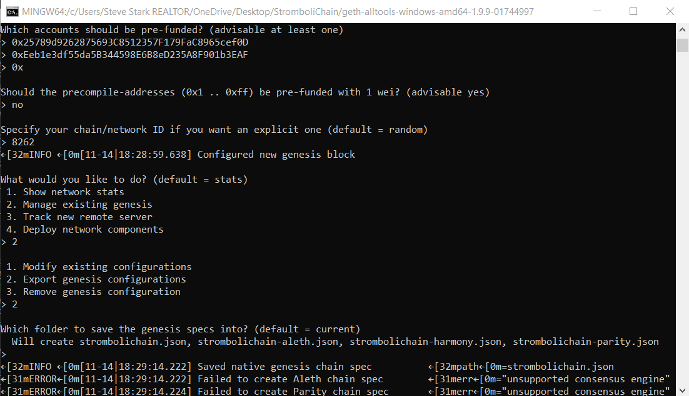

* After the last prompt, you will be returned to the original menu, with prompt 2 now reading Manage existing genesis. Select propmt 2. The next menu has three options, and you will select prompt 2 Export genesis configurations. Incidentally, if you have difficulties down the line and need to start over, this menu is where you can do that by selecting prompt 3. But don't do that now! Select prompt 2. 

* The next thing that you will see diesplayed on the screen is your successfully-created puppeth configuration. 

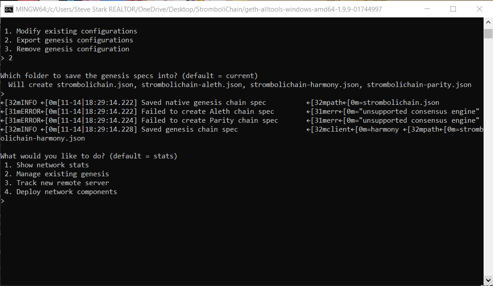

* In the puppeth configuration, you can see that two files were successfully output. However, only one is necessary, and that is strombolichain.json. You can remove the other one - strombolichain-harmony.json. 

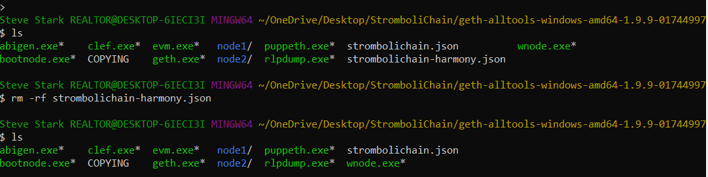

* Your genesis block has been set up, your account addresses are connected, and now the next steps are to initialize the accounts and start minting.

# III. Initialize Nodes 1 & 2

* If everything has gone well thus far, this step is pretty quick and easy. Return to the terminal window where you were working in step 1. 

* To initialize Node 1, enter: ./geth init strombolichain.json --datadir node1

* A number of lines will be produced, and on the last line it will state "Successfully wrote genesis state"

* To initialize Node 2, enter: ./geth init strombolichain.json --datadir node2  ##You can actually just hit the up arrow to bring up the previous command, then change the final digit from 1 to 2. 

* Again, you will be notified that you "Successfully wrote genesis state". Both nodes are not initialized, and it is time to start up the minting. 

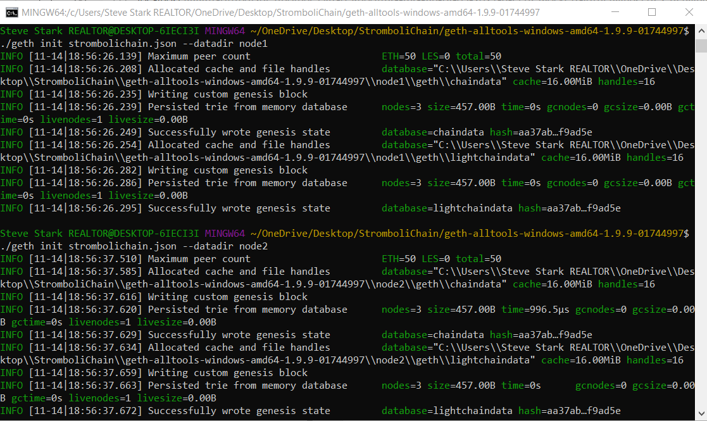

# IV. Start Minting on the StromboliChain PoA Network

* Open a new terminal window and enter your blockchain tools directory.

* To launch the first node into mining mode, you will enter the following command. Please note that this has proven to be a very finciky step in the process, and that your own particular set up on your own particular machine may cause GEth to expect something slightly different from you here. The command line I received in the tutorial I was following ended up not being sufficient to move forward. Here is the command line which worked for me: ./geth --datadir node1 --unlock 0x6BD2b256C9bCF61102e1c170a61EF73c22AA5043 --password password1.txt --rpc --allow-insecure-unlock --syncmode "fast" --mine --minerthreads 1

    * Note that you must enter the public address of node 1 following the --unlock flag. Also note that the flag --password is followed by the text file in which we earlier recorded our node1 password. 

*  If you successfully fired up Node 1, you will see it running, and you will see various messages indicating success as it gets up and running. If there is a problem with your set up, you will see error messages. 

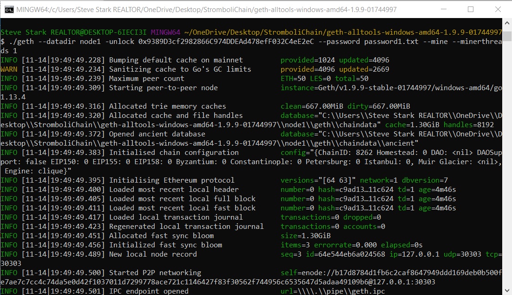

* Looking in the terminal output after starting node 1, you will see a line that says self=enode:// and then a long encryption string. Copy this line beginning with "enode" and all the way to the end, and save it in the same file where you saved the public addresses and private key paths for nodes 1 and 2. 

* Once again, open a new terminal window and enter your blockchain tools directory. We are going to start minting with node 2.

* Enter the following to launch the second node: ./geth --datadir node2 --unlock 0xdA5b179409b531fCb186258C7d86F7E8326aBCe1 --password password2.txt --mine --port 30304 --bootnodes "enode://fe7e8ba71cd777f518ae2a6d1a973a08a35699d003a21f1f34646e8c41b9a21967feadc05ddb3ef902bfcc5544fd82650ed5b599c38534b73255aae140b5cce9@127.0.0.1:30303" --ipcdisable --allow-insecure-unlock

    * Note that you must enter the public address of node 2 following the --unlock flag. Also note that the flag --password is followed by the text file in which we earlier recorded our node 2 password. Lastly, note that you must enter the "enode" line from node 1, and it must be encased in quotation marks. 

* Once all of this is executed, you should see various messages indicating success, and no error messages for node 2. 

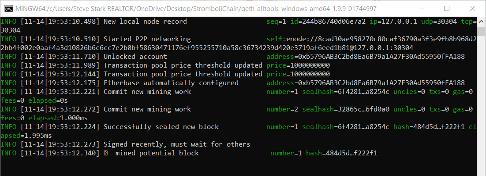

* At this point, both blockchains should be absolutely singing as they mint away on StromboliChain!

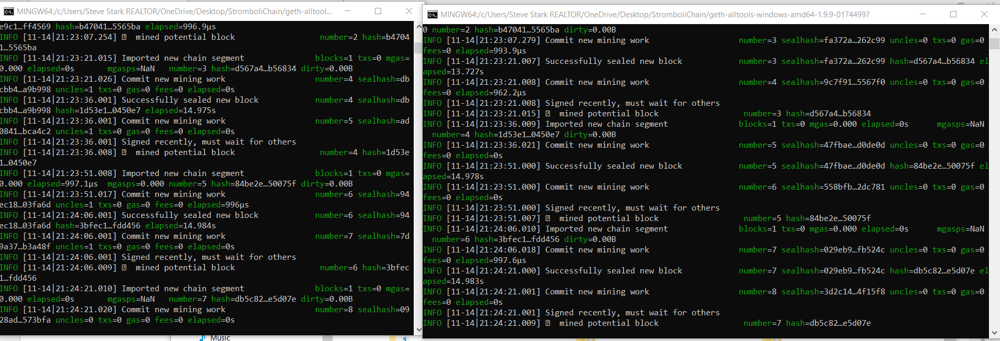

# V. Test Transaction

* With StromboliChain up and running, and both nodes minting, the last step is to connect to a testnet wallet and verify operability via a test transaction. 

* The first step will be to create a custom node in your MyCrypto wallet and connect StromboliChain to that node. Open your MyCrypto wallet and at the lower left select "Change Network". Then scroll down and select "Add Custom Node". 

* A window pops up. In the Network drop-down, select Custom, and then fill out the form with all the same information you provided when you first generated the genesis block. Under "Currency" type ETH, and make sure to use the correct chain ID from your genesis block. Also, enter your local host address http://127.0.0.1:8545. Then click "Save and Use Custom Node". 

* Log into your new network by selecting "View & Send" at the upper left, and then opt to sign in using a Keystore File. Click "Select Wallet File" and navigate to the keystore file saved in your node1 diretory. You will also manually enter the password you assigned to node 1. 

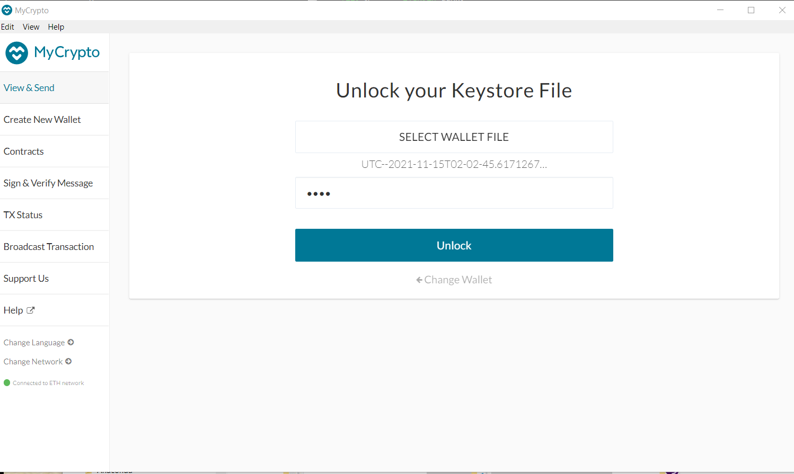

* Once logged in, you will see an astronomical amount of test Eth in your StromboliChain Node 1 wallet. Life is better on StromboliChain. 

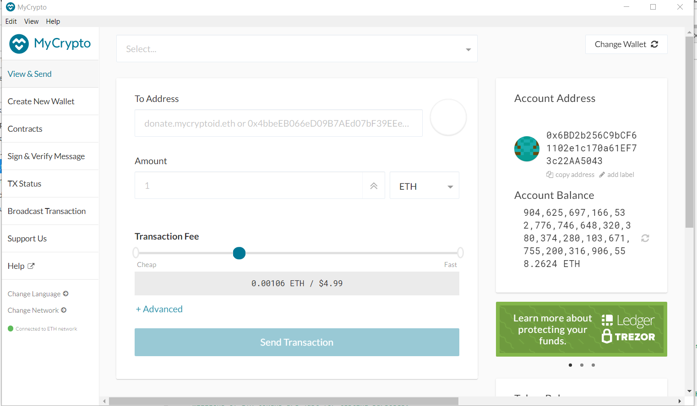

* In the "To Address" field, enter the public address for node 2. Choose how much test ETH to send to node 2. Click "Send Transaction", and then "Send".

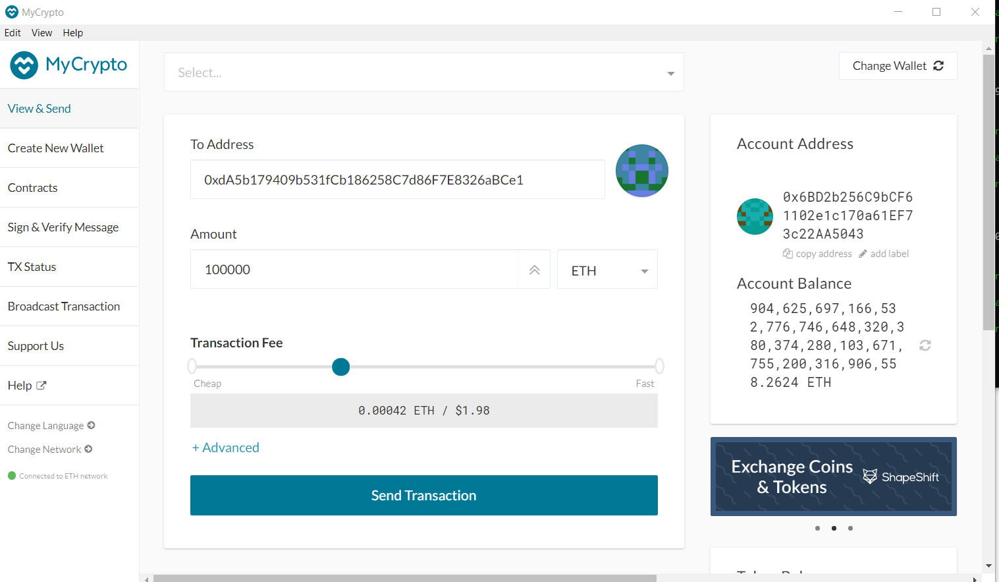

* The transaction will send, and a green message bar will appear across the bottom of MyCrypto, inviting you to check the status of the transaction. Click the "Check TX" button. This will prompt you to log out. Go ahead and log out. 

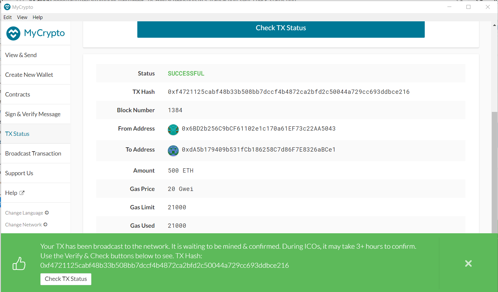

* Finally, you will receive confirmation that your ETH transaction on StromboliChain was indeed successful!

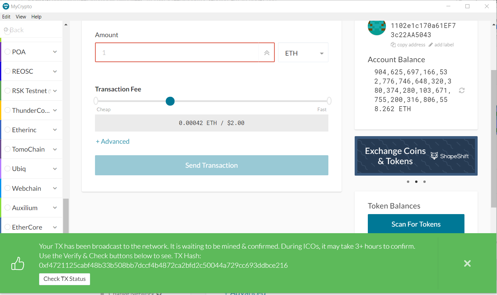

